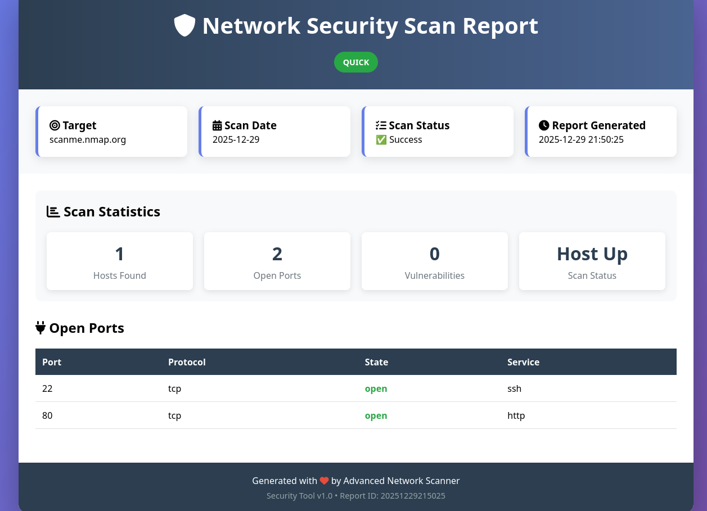

# 🔍 Advanced Network Security Scanner

[](https://www.python.org/)
[](LICENSE)
[](https://nmap.org/)
[](https://github.com/mrodripy/network-security-portfolio)

Professional network security assessment tool with automated multi-format reporting. Designed for cybersecurity professionals, penetration testers, and network administrators.

## ✨ Features

- **🚀 Multi-profile Scanning**: 5 specialized scan profiles (Discovery, Quick, Comprehensive, Vulnerability, UDP)
- **📊 Automated Reporting**: Generate professional reports in TXT, JSON, HTML, and Markdown formats
- **⚡ Real-time Monitoring**: Live scan progress display with detailed statistics
- **🎯 Intelligent Parsing**: Advanced result analysis and vulnerability detection
- **🐳 Docker Support**: Containerized deployment for consistent environments
- **📈 Extensible Architecture**: Easy to add custom scan profiles and parsers

## 🎯 Quick Start

### Prerequisites

```bash
# Install Nmap (required)
sudo apt install nmap        # Debian/Ubuntu
brew install nmap           # macOS
# Or download from: https://nmap.org/download.html

Basic Usage
bash

# Clone repository
git clone https://github.com/mrodripy/network-security-portfolio.git
cd network-security-portfolio

# Run a quick security assessment
python src/portfolio_scanner.py 192.168.1.1 --profile quick

# Discover active hosts in a network
python src/portfolio_scanner.py 192.168.1.0/24 --profile discovery

📊 Scan Profiles
Profile	Command	Time	Best For
🔍 Discovery	nmap -sn	Fast	Network inventory, host discovery
⚡ Quick	nmap -sS -T4 -F	Medium	Rapid security assessment
🔬 Comprehensive	nmap -sS -sV -sC -O -A	Slow	In-depth analysis with OS detection
⚠️ Vulnerability	nmap -sV --script vuln,safe	Very Slow	Security vulnerability assessment
📡 UDP	nmap -sU --top-ports 100	Medium	UDP service discovery
🖥️ Screenshots
HTML Report Example

*Professional HTML report with detailed statistics*

Terminal Output

Real-time scan execution with progress display
JSON Output Structure
json

{
  "metadata": {
    "target": "192.168.1.1",
    "profile": "quick",
    "timestamp": "2024-12-29T18:30:45",
    "command": "nmap -sS -T4 -F 192.168.1.1",
    "success": true
  },
  "statistics": {
    "hosts_up": 1,
    "open_ports": [
      {"port": "80", "protocol": "tcp", "service": "http"},
      {"port": "443", "protocol": "tcp", "service": "https"}
    ],
    "scan_status": "completed"
  }
}

🛠️ Installation
Method 1: Direct Usage (Recommended)
bash

git clone https://github.com/mrodripy/network-security-portfolio.git
cd network-security-portfolio
# No Python dependencies required! Just Nmap.

Method 2: Docker
bash

# Build the Docker image
docker build -t network-scanner .

# Run a scan (mount reports directory)
docker run -v $(pwd)/reports:/app/reports network-scanner \
  192.168.1.1 --profile discovery

Method 3: PIP Installation (Development)
bash

pip install -e .
# Then use: netsec-scan 192.168.1.1 --profile quick

📚 Usage Examples
Example 1: Network Discovery
bash

# Find all active devices in your local network
python src/portfolio_scanner.py 192.168.1.0/24 --profile discovery

Example 2: Security Assessment
bash

# Quick security check of a web server
python src/portfolio_scanner.py example.com --profile quick --output security_reports

Example 3: Vulnerability Scan
bash

# Vulnerability assessment (authorized targets only!)
python src/portfolio_scanner.py 192.168.1.100 --profile vulnerability

Example 4: Custom Configuration
bash

# Scan specific ports with custom output directory
python src/portfolio_scanner.py target.com --profile quick \
  --output /path/to/custom/reports

📁 Project Structure
text

network-security-portfolio/
├── src/                    # Source code
│   ├── portfolio_scanner.py    # Main scanner class
│   └── utils/             # Utilities
│       └── json_to_html.py    # JSON to HTML converter
├── examples/              # Usage examples
│   └── basic_usage.py    # Example scripts
├── tests/                 # Unit tests
│   └── test_basic.py     # Test suite
├── docs/                  # Documentation
│   ├── INSTALL.md        # Installation guide
│   └── USAGE.md          # Usage guide
├── screenshots/          # Screenshots for documentation
├── .gitignore           # Git ignore rules
├── LICENSE              # MIT License
├── requirements.txt     # Python dependencies
├── setup.py            # Package configuration
└── README.md           # This file

🧪 Running Tests
bash

# Run basic tests
python -m pytest tests/

# Test specific module
python tests/test_basic.py

🤝 Contributing

Contributions are welcome! Here's how you can help:

    Fork the repository

    Create a feature branch (git checkout -b feature/AmazingFeature)

    Commit changes (git commit -m 'Add AmazingFeature')

    Push to branch (git push origin feature/AmazingFeature)

    Open a Pull Request

Development Setup
bash

# 1. Fork and clone
git clone https://github.com/YOUR_USERNAME/network-security-portfolio.git

# 2. Create virtual environment
python -m venv venv
source venv/bin/activate  # On Windows: venv\Scripts\activate

# 3. Install development dependencies
pip install -r requirements-dev.txt

# 4. Run tests
pytest tests/

📈 Performance Tips

    For large networks: Use --profile discovery first to identify active hosts

    Speed vs depth: Quick scans take minutes, vulnerability scans can take hours

    Resource usage: UDP scans are resource-intensive; use with caution

    Parallel scanning: The scanner supports timeout configurations for long scans

🐛 Troubleshooting
Common Issues
Issue	Solution
"Nmap not found"	Install Nmap: sudo apt install nmap
"Permission denied"	Some scans require root: sudo python src/portfolio_scanner.py...
"Scan timed out"	Increase timeout in code or scan smaller ranges
"No hosts found"	Verify network connectivity and target IP
Debug Mode
bash

# Run with verbose output
python src/portfolio_scanner.py 127.0.0.1 --profile quick 2>&1 | tee debug.log

📄 License

This project is licensed under the MIT License - see the LICENSE file for details.
⚠️ Legal & Ethical Notice

IMPORTANT: This tool is intended for:

    ✅ Authorized security assessments

    ✅ Educational purposes

    ✅ Testing your own networks

    ✅ CTF competitions and labs

NEVER use this tool on networks you don't own or have explicit permission to test. Unauthorized scanning is illegal and unethical.

Always obtain proper authorization before conducting any security assessment.
🙏 Acknowledgments

    Nmap Security Scanner - The backbone of this project (nmap.org)

    Python Community - For amazing libraries and tools

    Open Source Security Tools - That inspire continuous improvement

    Contributors - Everyone who helps improve this project

📞 Contact & Support

    GitHub Issues: Report bugs or request features

    Email: mrodriguex@hotmail.com

    LinkedIn: Miguel Rodriguez

⭐ If you find this project useful, please give it a star on GitHub!

⬆ Back to Top
